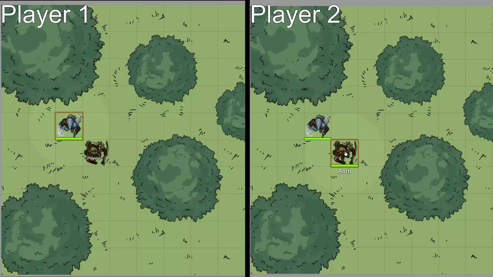

# Overhead Tile Fade for All Tokens
When a token goes under an overhead tile with fade, the default is to only have it fade for that token. This hides the token for all other tokens and players. This module overrides the default behavior to have the fade show for all tokens instead so the token remains visible to all players. This only applies to tiles with the fade occlusion setting. 

## Without the Module

## With the Module
